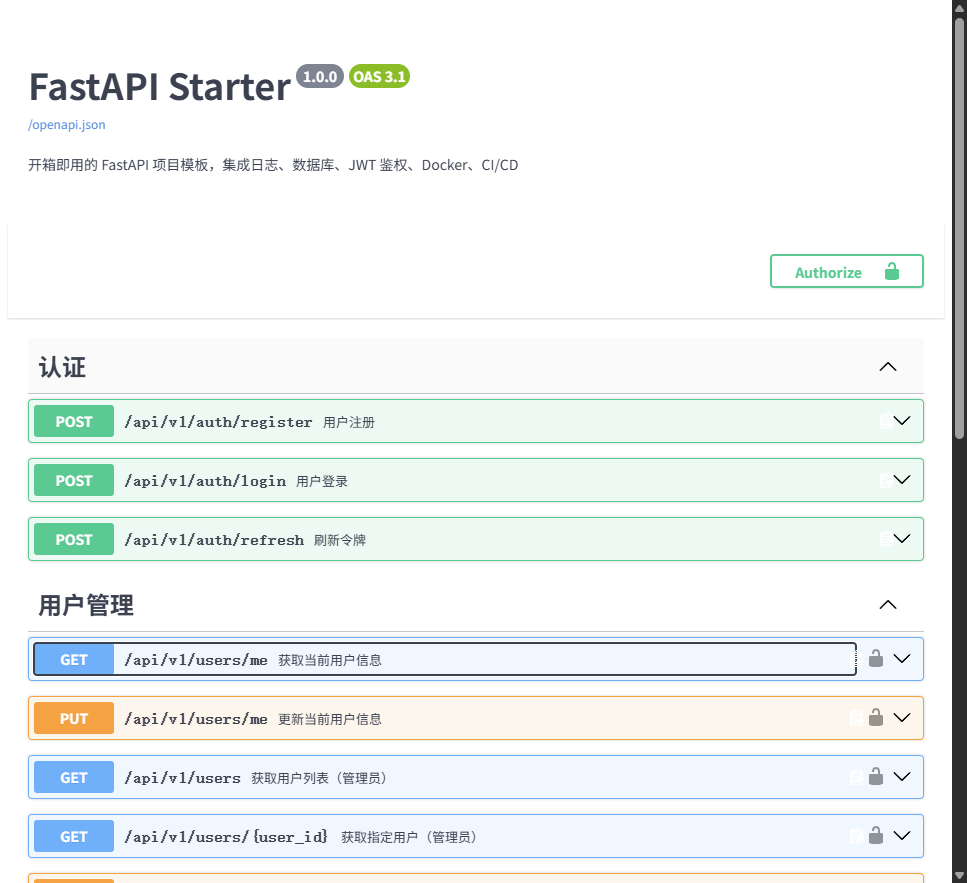

<div align="center">

# FastAPI Starter

**开箱即用的 FastAPI 项目模板** — 集成日志、数据库、JWT 鉴权、Docker、CI/CD，复制即可开发后台服务。



[](https://www.python.org/)
[](https://fastapi.tiangolo.com/)
[](LICENSE)
[](https://github.com/yourname/fastapi-starter/actions)

[English](README.en.md) | **中文**

</div>

---

## 特性

- **FastAPI** — 高性能异步 Web 框架，自动生成交互式 API 文档
- **JWT 鉴权** — 内置注册、登录、令牌刷新、权限分级（普通用户/管理员）
- **数据库** — SQLAlchemy 2.0 ORM，支持 MySQL / PostgreSQL / SQLite，开箱即用
- **统一日志** — 控制台 + 文件双输出，自动滚动，结构化格式
- **全局异常处理** — 业务异常、参数校验、HTTP 异常统一捕获，返回标准化 JSON
- **Docker** — 多阶段构建，docker-compose 一键启动（含 MySQL）
- **CI/CD** — GitHub Actions 自动代码检查 + 多版本测试 + Docker 构建
- **完整测试** — pytest 集成测试，内存数据库隔离
- **清晰架构** — 分层设计（router / service / model / schema），易于扩展

---

## 快速开始

### 方式一：本地运行（推荐开发用）

```bash
# 1. 克隆项目
git clone https://github.com/yourname/fastapi-starter.git
cd fastapi-starter

# 2. 创建虚拟环境
python -m venv venv
# Windows:
venv\Scripts\activate
# macOS/Linux:
# source venv/bin/activate

# 3. 安装依赖
pip install -r requirements.txt

# 4. 配置环境变量
copy .env.example .env
# 编辑 .env，修改数据库连接和 JWT 密钥

# 5. 启动服务
python -m app.main
```

服务启动后访问：
- API 文档（Swagger）: http://localhost:8000/docs
- API 文档（ReDoc）: http://localhost:8000/redoc
- 健康检查: http://localhost:8000/health

### 方式二：Docker 一键启动（推荐部署用）

```bash
# 克隆并进入项目
git clone https://github.com/yourname/fastapi-starter.git
cd fastapi-starter

# 一键启动（自动构建镜像 + 启动 MySQL + 启动应用）
docker-compose up -d

# 查看日志
docker-compose logs -f web
```

---

## API 示例

### 1. 注册用户

```bash
curl -X POST http://localhost:8000/api/v1/auth/register \
  -H "Content-Type: application/json" \
  -d '{
    "username": "demo",
    "email": "demo@example.com",
    "password": "demo123456",
    "full_name": "Demo User"
  }'
```

### 2. 登录获取令牌

```bash
curl -X POST http://localhost:8000/api/v1/auth/login \
  -d "username=demo&password=demo123456"
```

返回：
```json
{
  "access_token": "eyJhbGciOiJIUzI1NiIs...",
  "refresh_token": "eyJhbGciOiJIUzI1NiIs...",
  "token_type": "bearer",
  "expires_in": 1800
}
```

### 3. 访问需要鉴权的接口

```bash
curl -X GET http://localhost:8000/api/v1/users/me \
  -H "Authorization: Bearer 你的access_token"
```

---

## 项目结构

```
fastapi-starter/
├── app/
│   ├── __init__.py
│   ├── main.py              # 应用入口，创建 FastAPI 实例
│   ├── config.py            # 配置管理（pydantic-settings）
│   ├── database.py          # 数据库连接与会话
│   ├── dependencies.py      # 全局依赖注入（当前用户、管理员）
│   ├── models/              # SQLAlchemy 数据模型
│   │   └── user.py
│   ├── schemas/             # Pydantic 请求/响应模型
│   │   └── user.py
│   ├── routers/             # API 路由层
│   │   ├── auth.py          # 认证路由（注册/登录/刷新）
│   │   └── user.py          # 用户管理路由
│   ├── services/            # 业务逻辑层
│   │   └── auth.py
│   └── utils/               # 工具模块
│       ├── logger.py        # 日志配置
│       ├── exceptions.py    # 自定义异常与全局处理器
│       └── security.py      # 密码哈希、JWT 令牌
├── tests/
│   └── test_main.py         # 集成测试
├── .github/
│   └── workflows/
│       └── ci.yml           # GitHub Actions CI/CD
├── .env.example             # 环境变量模板
├── .gitignore
├── Dockerfile               # 多阶段 Docker 构建
├── docker-compose.yml       # 应用 + MySQL 编排
├── requirements.txt         # Python 依赖
├── pyproject.toml           # 项目元数据与 pytest 配置
├── README.md                # 中文文档
└── README.en.md             # 英文文档
```

---

## 常用命令

```bash
# 运行测试
pytest tests/ -v

# 代码格式化（Black）
black app/ tests/

# 代码检查（Ruff）
ruff check app/ tests/

# 生成 Alembic 迁移（首次使用需初始化）
# alembic init alembic
# alembic revision --autogenerate -m "init"
# alembic upgrade head

# Docker 相关
docker-compose up -d          # 启动
docker-compose down           # 停止
docker-compose logs -f web    # 查看应用日志
docker-compose restart web    # 重启应用
```

---

## 环境变量说明

| 变量 | 默认值 | 说明 |
|------|--------|------|
| `APP_NAME` | FastAPI Starter | 应用名称 |
| `APP_ENV` | development | 运行环境（development/production） |
| `APP_DEBUG` | true | 调试模式 |
| `DATABASE_URL` | sqlite:///./test.db | 数据库连接串 |
| `JWT_SECRET_KEY` | change-me | JWT 签名密钥（**生产环境必须修改**） |
| `JWT_ACCESS_TOKEN_EXPIRE_MINUTES` | 30 | 访问令牌有效期（分钟） |
| `JWT_REFRESH_TOKEN_EXPIRE_DAYS` | 7 | 刷新令牌有效期（天） |
| `LOG_LEVEL` | INFO | 日志级别 |
| `CORS_ORIGINS` | localhost:3000,5173 | 允许的跨域来源 |

---

## 贡献

欢迎提交 Issue 和 Pull Request！

1. Fork 本仓库
2. 创建特性分支 (`git checkout -b feature/AmazingFeature`)
3. 提交更改 (`git commit -m 'Add some AmazingFeature'`)
4. 推送到分支 (`git push origin feature/AmazingFeature`)
5. 开启 Pull Request

---

## License

MIT License — 详见 [LICENSE](LICENSE) 文件。

---

<div align="center">

如果这个项目对你有帮助，欢迎给个 Star 支持！

</div>
